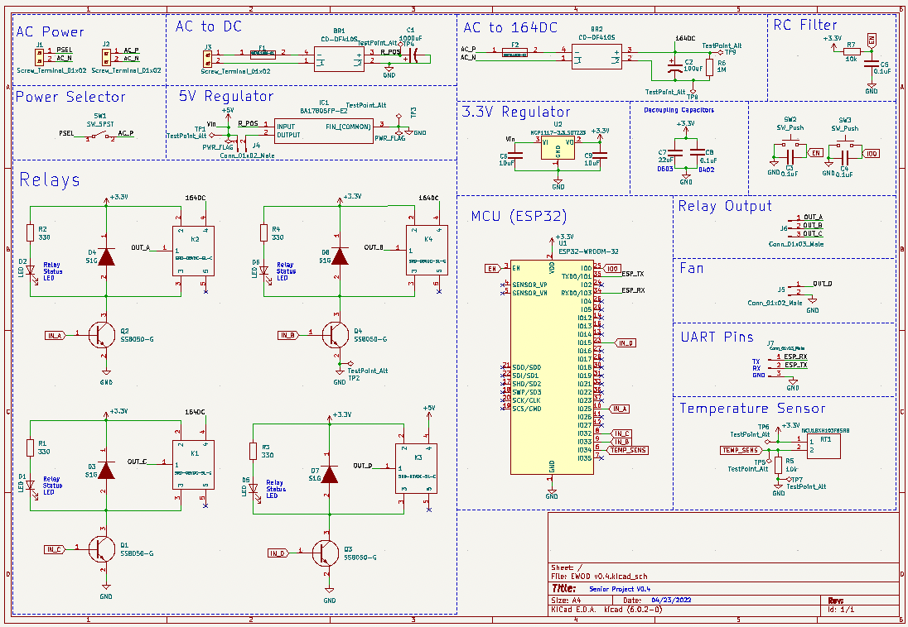
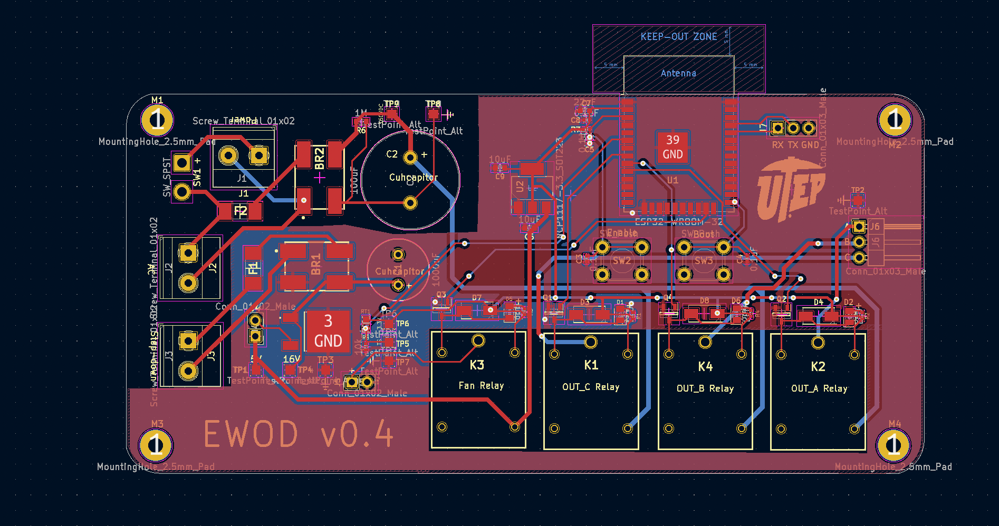
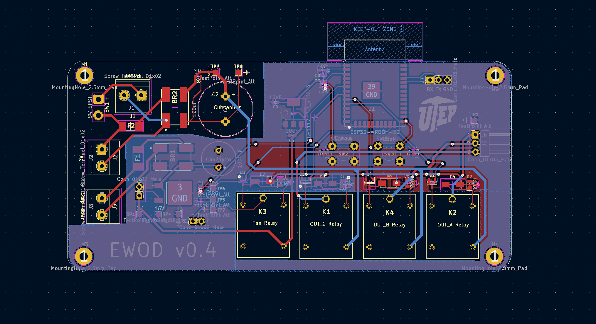
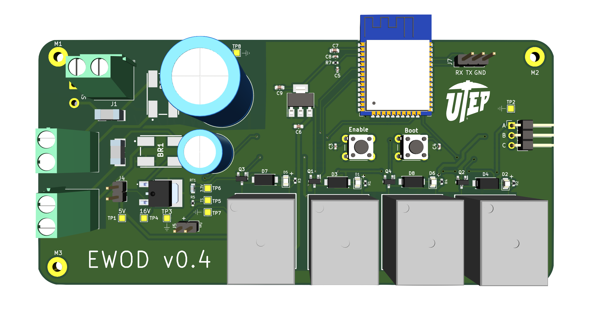

# **EWOD Hardware** :zap:
This directory hold the hardware files for EWOD which was developed in KiCad.

## **Table of Contents**
* **EWOD KiCad**
  * EWOD hardware development was done in KiCad
* **jlcpcb**
  * JLCPCB files for assembly and gerber files

## **Schematic**

## **Top Layer**

## **Bottom Layer**

## **Printed Circuit Board**

## **Author**
* [**Jesus Minjares**](https://github.com/jminjares4) 
  * **Master of Science in Computer Engineering** 
 
 
